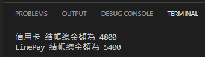

# Home Work
Start Date: 2022-12-29

使用設計模式: 策略模式、工廠模式、責任鏈 實作出不同付款方式算出的金額 use TypeScript
- input 付款方式:`string`, 明細金額: `number[]`
- `console.log('顯示的折扣金額');`

共 2 種付款方式
1. 信用卡: 金額打 8 折並無條件捨去
2. LinePay: 金額滿千送百，$1000 折抵 $100，$2000 折抵 $200

---
Ref:
- Chain of Responsibility
  - [Chain of Responsibility in TypeScript](https://refactoring.guru/design-patterns/chain-of-responsibility/typescript/example)
- Strategy pattern
  - [Strategy](https://refactoring.guru/design-patterns/strategy)
  - [TypeScript - Gof 23 Design Pattern (17)：Strategy Pattern](https://ithelp.ithome.com.tw/articles/10202524)
  - [Java's Design Patterns - Strategy Pattern](https://www.tutorialspoint.com/design_pattern/strategy_pattern.htm)