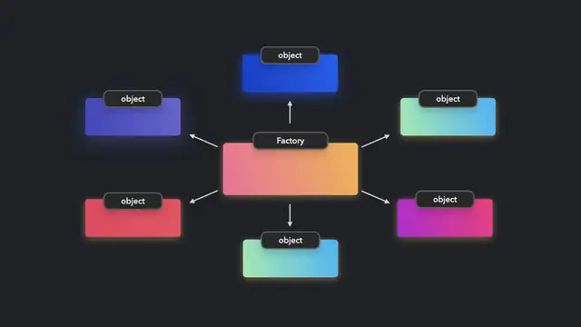

### 工廠模式:
 * source: [OOP doc from google drive](https://drive.google.com/drive/folders/1McWN1mSwTCRme0gui3bPW0O_4xF5amiI)
 * 原來的程式碼不需要增加 if else 判斷,已經將變化封裝成相同 interface 的不同 class
 * 程式碼只與 interface 耦合,不與 function 耦合 ; 呼叫端只認 interface,不認 function,只要 interface 不變,function 呼叫端不必修改
 * 相同的物件可抽象化成 class
 * 物件裡的 function 稱作方法 (Method): bracket notation OR dot notation
 * [qmo's nbaFactory.ts](https://github.com/QmoGamer/oop_homework/blob/homework/nbaFactory.ts)
 * A function is a factory function when it returns a new object without the use of the new keyword
 * When writing the logic inside our methods, we use the this keyword to target values in the current object the method belongs to. This is really powerful because it allows our object instances to update and manage their own state.
 *  from https://www.patterns.dev/posts/

### 策略模式
目的: 不需動結構即可增加新的付款方式及折扣規則
1. 設置原始資料: 明細金額。
2. 封裝運算模式
3. 當 user 呼叫計算時，將請求委託給之前存放好的策略物件

## OOP
- 類別本身是物件的一種，具備 Static 的特性
- Instance 具備 Dynamic 的特性
- OOP 的核心觀念: Encapsulation, Inheritance, Polymorphism

### 問答:
- 會有各種模式混用的情境嗎？(&&)
- 如果沒有，是否有多重選擇的情境？(||)如果有，會有順序性嗎？
- 